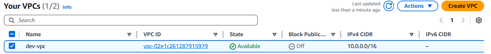
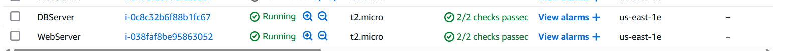
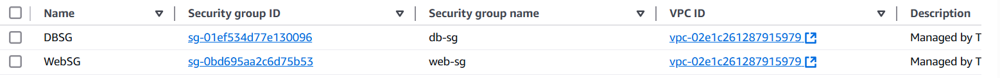

# Terraform AWS Nginx Deployment

## 📌 About Terraform
Terraform is an **Infrastructure as Code (IaC)** tool that allows you to define and provision infrastructure using a declarative configuration language. It helps automate cloud infrastructure deployment efficiently and consistently.

## 🚀 Project Overview
This project provisions an **AWS infrastructure** using Terraform to deploy a **simple Nginx web server**. The infrastructure consists of:

- **VPC** with Public & Private Subnets
- **Internet Gateway** for public subnet access
- **Security Groups** to restrict access
- **EC2 Instances** (Web Server & Database Server)
- **User Data** to install and start Nginx automatically

## 🏗️ Infrastructure Diagram


## 🔧 Prerequisites
- AWS account
- Terraform installed (`terraform -v` to check)
- AWS CLI configured (`aws configure`)
- Git installed (`git --version` to check)

## 📜 Terraform Commands

### **1️⃣ Initialize Terraform**
```bash
terraform init
```
Initializes the Terraform working directory.

### **2️⃣ Format Code**
```bash
terraform fmt
```
Formats Terraform configuration files.

### **3️⃣ Validate Configuration**
```bash
terraform validate
```
Checks for syntax errors.

### **4️⃣ Plan the Deployment**
```bash
terraform plan
```
Shows the execution plan before applying changes.

### **5️⃣ Apply the Changes**
```bash
terraform apply -auto-approve
```
Creates and provisions the AWS resources.

### **6️⃣ Destroy the Resources**
```bash
terraform destroy -auto-approve
```
Deletes all infrastructure components.

## 📂 Project Structure
```
terraform-aws-project/
├── provider.tf          # AWS Provider Configuration
├── main.tf              # VPC, Subnets, and Security Groups
├── variables.tf         # Input Variables
├── outputs.tf           # Outputs
├── userdata.sh          # User Data Script
├── README.md            # Documentation
```

## 🌍 How to Access the Web Server
1. Get the **public IP** of the EC2 instance:
   ```bash
   terraform output web_server_ip
   ```
2. Open a web browser and enter:
   ```
   http://<PUBLIC_IP>
   ```
You should see **"Welcome to Anjum's Website 🚀"** displayed.

## 🎯 Future Enhancements
- Add an **Application Load Balancer (ALB)**
- Implement **Auto Scaling**
- Integrate with a **CI/CD Pipeline**

## 🤝 Contributions & Feedback
I’m open to suggestions! Feel free to fork, modify, and contribute.

📢 Let's build and learn together! 🚀
Here are few snapshots of my application:





